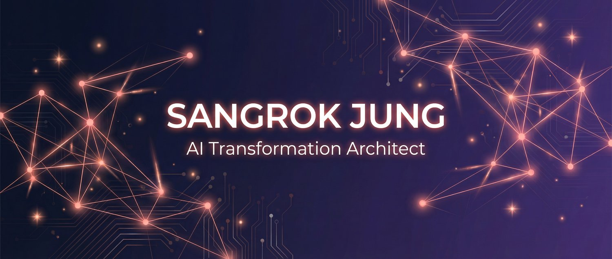

  

  
  
  
  

---

<table>
<tr>
<td width="55%" valign="top">

### About

비즈니스에 AI를 심는 사람입니다.

**AX(AI Transformation)** — 단순 도구 도입이 아니라,
업무 프로세스 자체를 AI 중심으로 재설계하는 것.

기업이 AI를 "써보는" 단계에서 
**"운영하는" 단계로** 넘어가도록 설계하고 구현합니다.

</td>
<td width="45%" valign="top">

### What I Do

🔧 **B2B AX 컨설팅** 
기업 맞춤형 AI 업무 자동화 설계 및 구현

📚 **AX 교육** 
Make.com, n8n, Claude Code 기반 실전 강의

🛠️ **오픈소스** 
AI 개발 도구 프레임워크 공개 및 운영

</td>
</tr>
</table>

---

### Featured Open Source

> **[Claude Forge](https://github.com/sangrokjung/claude-forge)** — Claude Code를 완전한 개발 환경으로 변환하는 프레임워크 
> `11 Agents` `36 Commands` `15 Skills` `14 Hooks` `MIT License`

---

### Tech Stack

  

  
  
  
  
  

---

### GitHub Activity

  
  

<picture>
  <source media="(prefers-color-scheme: dark)" srcset="https://raw.githubusercontent.com/sangrokjung/sangrokjung/output/github-snake-dark.svg">
  <source media="(prefers-color-scheme: light)" srcset="https://raw.githubusercontent.com/sangrokjung/sangrokjung/output/github-snake.svg">
  
</picture>

---

### Connect

  
  
  
  
  
  

  📧 <a href="mailto:sesileo82@gmail.com">sesileo82@gmail.com</a>

